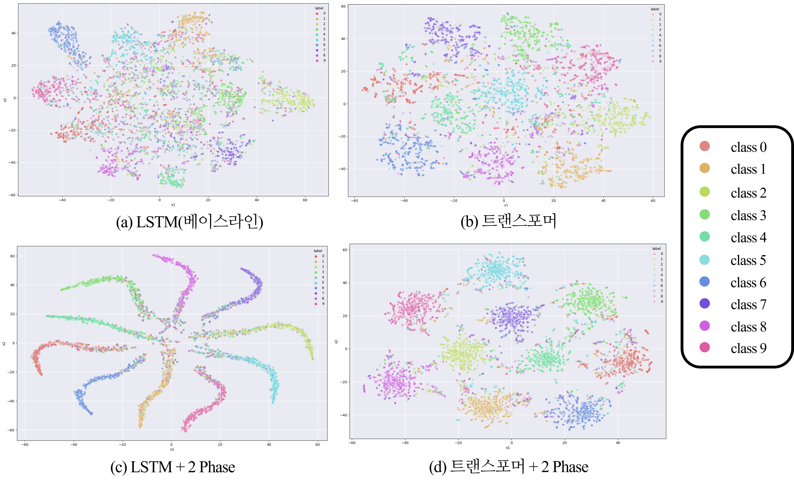

# Improving EEG Classification Model Performance with a Transformer-Based Two-Phase Training Approach
> '24W Deep Daiv Deep Learning Architecture Project

## Overview
The classification model in the previous study showed **low performance because it could not capture spatial information of EEG signals**, and according to the t-SNE visualization results, there was a limitation that the cluster by each of the 10 classes is not clear**. Furthermore, EEG signals frequently overfit occurs due to differences in signal from person to person, and the existing model cannot cope with the prevention of such overfit. Therefore, the baseline [EEG2IMAGE](https://github.com/prajwalsingh/EEG2Image) wanted to improve the classification model performance.

## Aritecture
### :one: Encoder
We used a transformer-based model to extract features from EEG data. Existing convolutional network-based approaches tend to capture only a specific portion of spatial information mainly. To address this, we introduced a transformer-based model to extract both temporal and spatial information of EEG data and the model structure is as follows.

### :two: 2-Phase
In the case of EEG signals, overfitting frequently occurs due to differences in signals from person to person. To prevent such overfitting, we propose a 2-Phase learning method. The overall structure of the proposed 2-Phase learning method is as follows.

## Result
### 1. Classifier 
To evaluate the classifier performance, we used two metrics: 1. k-means accuracy and 2. accuracy. To demonstrate the effectiveness of the proposed framework, we compared the performance by setting [EEG2IMAGE](https://github.com/prajwalsingh/EEG2Image), an existing model trained with the same dataset, as a baseline.
| Model   |Accuarcy | K-Means Accuracy |
| ------ |------ | ------ |
|LSTM(Baseline) | 72.95% | 53% |
|LSTM + 2 Phase(Ours) | 74.18% | 74% |
|Transformer | 75.01% | 73% |
|Transformer + 2 Phase(Ours) :star2:| **78.04%** | **78%** |

In addition, t-SNE visualization was conducted to visualize the clustering of features in **test data**, and the results are as follows.

### 2. 2-Phase Training
To demonstrate the learning effect of 2-Phase, t-SNE visualization in Phase 1 and Phase 2 was trained, and the results are as follows.

## Code
- Baseline Code : EEG2IMAGE
- Transformer Based Encoder Code : EEGFormer
- 2 Phase Code : 2Phase
